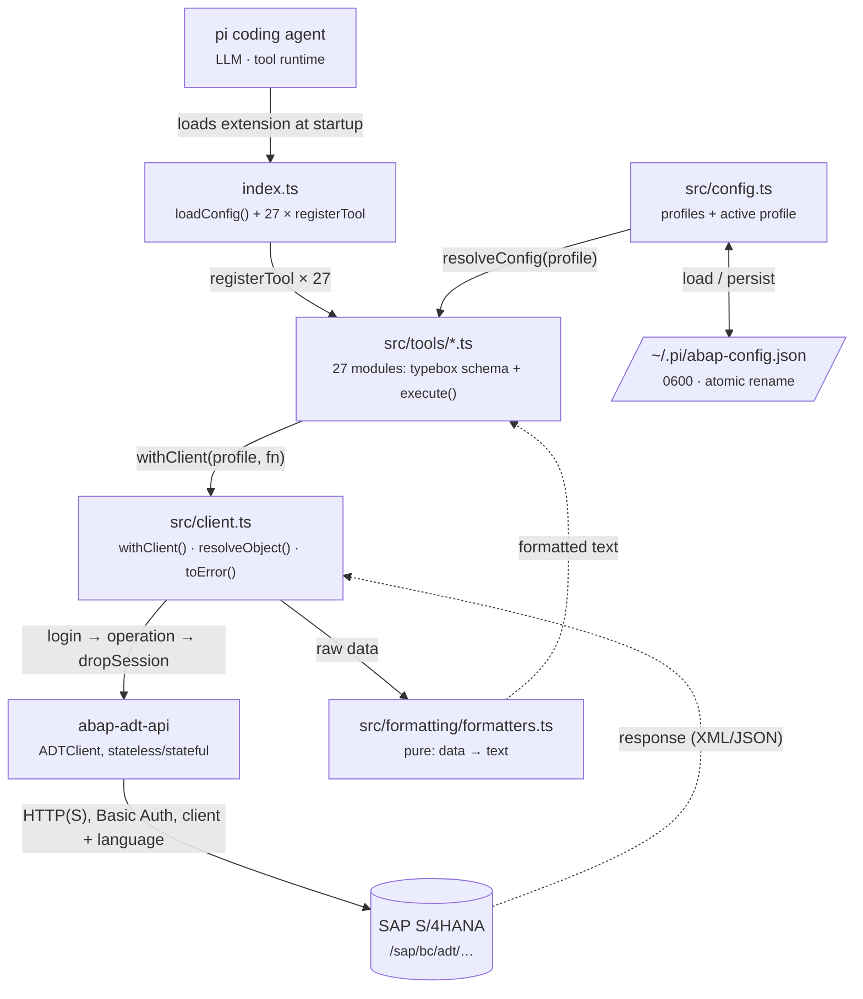
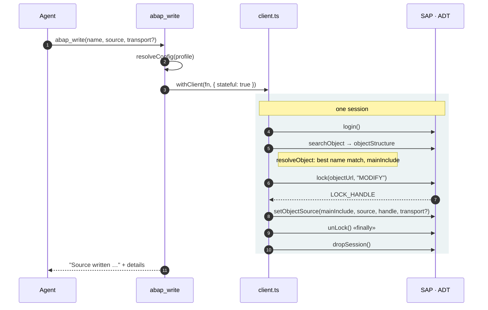

# Architecture

The extension bridges two worlds: the agent speaks tool calls, SAP speaks
ADT-REST. In between lie four layers with clear responsibilities.

## Layers

The downward path is the call path; the dashed edges are the return path: raw
ADT responses pass through the pure formatters and leave the tool as text plus a
structured `details` object. `src/types.ts` deliberately sits beside the flow,
which is why it is absent from the diagram — it holds only data shapes and error
classes, no behavior.

## Flow of a write operation (`abap_write`)

Writing requires a lock, and the lock only holds within *one* stateful session.
Hence `stateful: true`, and hence `unLock` sits in a `finally`.

If a `lockHandle` from an earlier `abap_lock` is supplied, `lock` and `unLock`
are skipped — the lock then belongs to the caller and stays in place. Activation
is never automatic: `abap_activate` is a separate call.

## Tools by task

| Group | Tools |
|---|---|
| Connection | `abap_setup`, `abap_status`, `abap_profile`, `abap_test_connection` |
| Search & read | `abap_search`, `abap_object_types`, `abap_node_contents`, `abap_object_structure`, `abap_read`, `abap_where_used`, `abap_text_elements` |
| Modify | `abap_lock`, `abap_unlock`, `abap_write`, `abap_activate`, `abap_create_object`, `abap_set_text_elements` |
| Check & test | `abap_syntax_check`, `abap_unit_test`, `abap_atc` |
| Data | `abap_query`, `abap_table` |
| Operations & transport | `abap_transports`, `abap_transport_details`, `abap_dumps`, `abap_traces`, `abap_trace_hitlist` |

## Decisions

- **Session per call** (`withClient`) — fresh client, login, `dropSession` in the
  `finally`. No shared connection state between tools.
- **stateless as the default** — only locking operations run `stateful`.
- **Errors are normalized** (`toError`) — the model sees the SAP message
  directly; dedicated error classes say what to do next (e.g. "run `abap_setup`
  first").
- **Profile file written atomically** — temp file with `0600` and `rename`,
  because `writeFileSync` with `mode` does not change the permissions of an
  existing file.
- **Side-effect-free formatters** — data in, string out; which is why most of
  the code is testable without an SAP system.
- **No build step** — pi loads `index.ts` via jiti; `tsc` only runs as a
  `--noEmit` typecheck.
